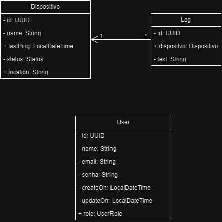

## SOBRE

Programa desenvolvido com a finalidade de monitorar dispositivos conectados a rede local.<br> Backend feito na arquitetura MVC com JAVA 17 + Spring Boot, Spring Data JPA, SpringSecurity.

o backend tem as seguintes endpoins:


- USER
    - `POST` /user
    - `POST` /user/login
- LOG
    - `GET` /log/{id}
    - `POST` /log

- DISPOSITVO
    - `GET` /device
    - `GET` /device/unregistred
    - `GET` /device/validateAtivo
    - `GET` /device/validateInativo
    - `GET` /device/{id}
    - `POST` /device
    - `PUT` /device/{id}
    - `DELETE` /device/{id}

O front-end foi desenvolvido em ```next.js 14```, há uma camada de estilos, uma para componetes e as páginas. Há uma tela de Login, de registro, de visualização de dispositivos e visualização de logs.

Para o banco estou utilizando PostgreSQL.

### Diagrama de classe 

demonstração de como está a disposição das classes.



## Começando

É necessário instalar o programa nmap security para realizar uma varredura na rede local. segue o link do programa <a href="https://nmap.org/download#windows">clique aqui</a>

> [!IMPORTANT]
>
> Estou utilizando o docker para ter uma instância do postrgresql.
>
> caso esteja utilizando docker, utiliza o comando: `docker-compose -f ./docker-compose.yalm up -d`

### iniciando o back-end

Este guia fornece instruções para iniciar o backend existente usando Spring Boot, Spring Data JPA e Spring Security, com Java 17.

- Requisitos

    - [Java 17](https://www.oracle.com/java/technologies/javase-jdk17-downloads.html)
    - [Maven](https://maven.apache.org/download.cgi)
    - [Eclipse](https://www.eclipse.org/downloads/)

- Configurações de conexão com o banco:
    - spring.datasource.url=${POSTGRES_URL:jdbc:postgresql://localhost:5432/teste}
    - spring.datasource.username=${POSTGRES_USER:dev}
    - spring.datasource.password=${POSTGRES_PASSWORD:123456}
    - spring.jpa.hibernate.ddl-auto= update
    - pring.jpa.properties.hibernate.dialect=org.hibernate.dialect.PostgreSQLDialect

Certifique-se de que todas as dependências necessárias estão instaladas. Use o `mvn install`


### iniciando o front-end

Primeiro, inicie o servidor de desenvolvimento:

```bash
npm run dev
# ou
yarn dev
# ou
pnpm dev
# ou
bun dev
```

Abra http://localhost:3000 no seu navegador para ver o resultado.

Este projeto utiliza next/font para otimizar e carregar automaticamente o Inter, uma fonte personalizada do Google.